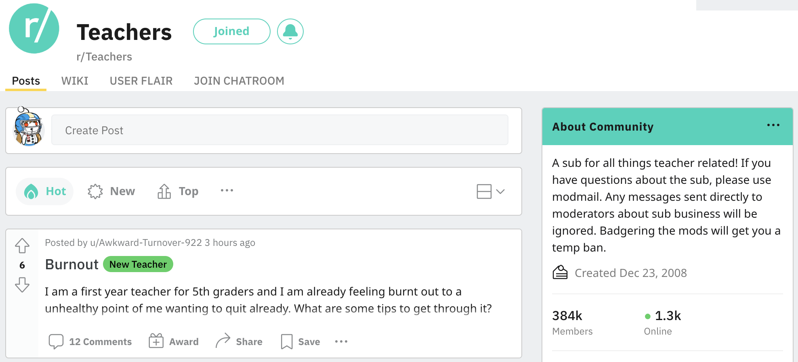
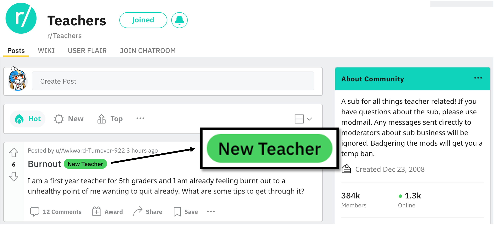
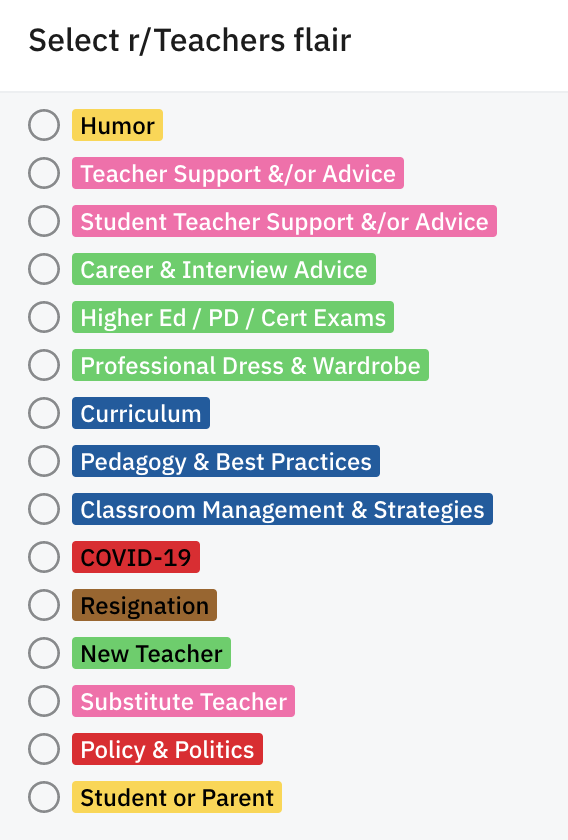
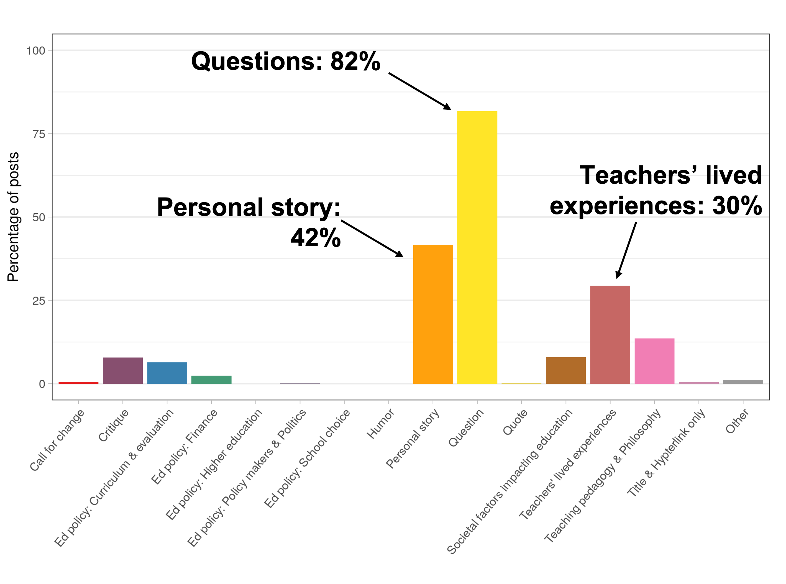
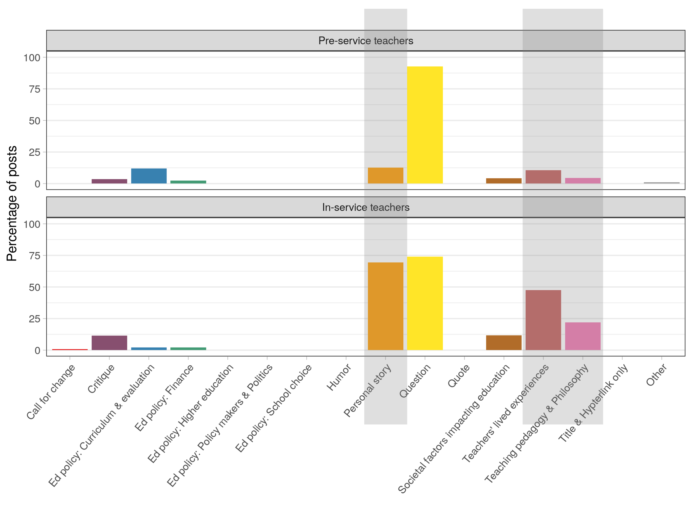
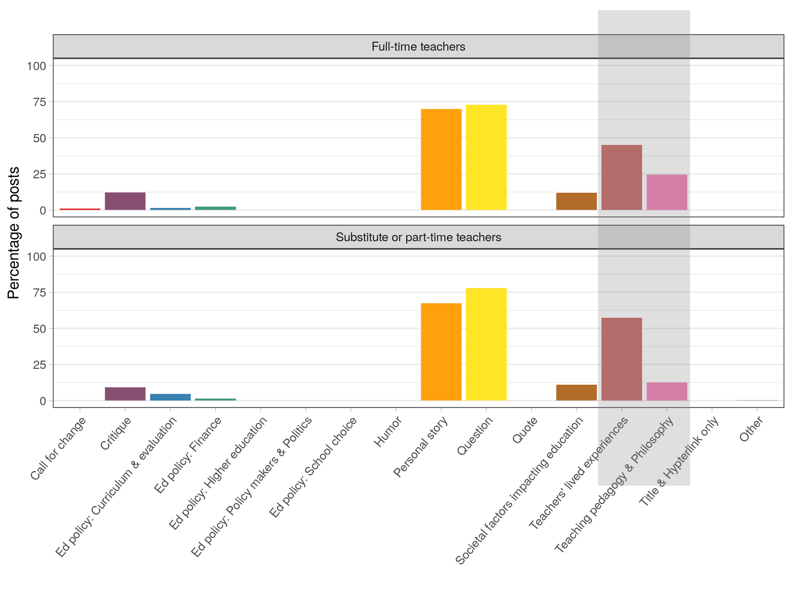
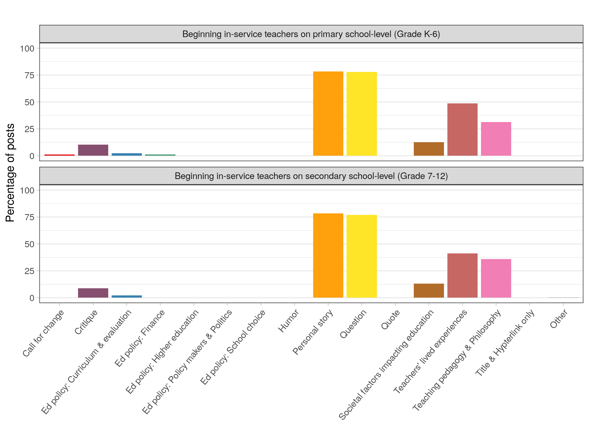
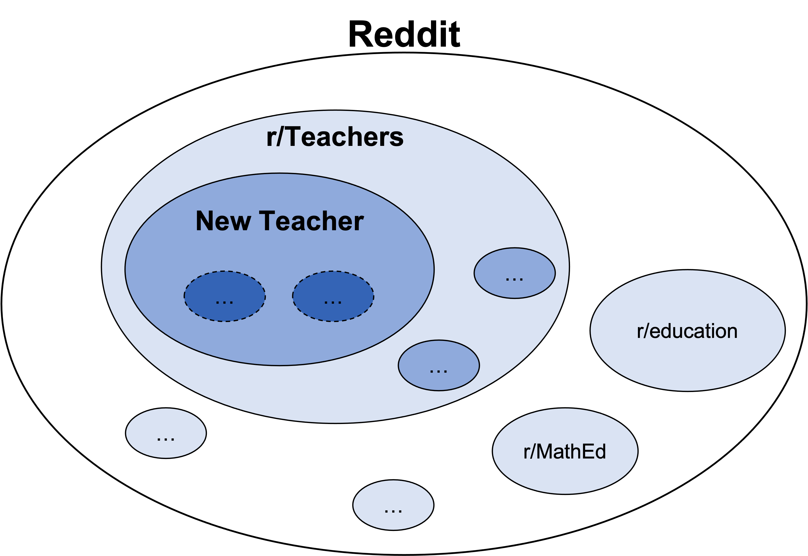
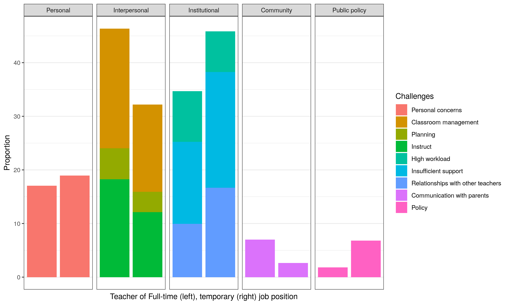

```{r setup, include=FALSE}
usethis::use_git_ignore(c("*.csv", "*.rds"))
options(htmltools.dir.version = FALSE)

library(knitr)
library(tidyverse)
library(xaringan)
library(fontawesome)
```

class: inverse, center, middle

# `r fa("far fa-compass", fill = "#fff")` <br><br> Background

---

# `r fa("far fa-compass", fill = "#fff")` Reddit?

```{r, out.width = "70%", echo = FALSE, fig.align = "center"}

```

* Reddit: A popular **social media platform**


---


# `r fa("far fa-compass", fill = "#fff")` Reddit?

```{r, out.width = "70%", echo = FALSE, fig.align = "center"}

```

* Reddit: A popular **social media platform**

* Lots of **discussion forums**


---

# `r fa("far fa-compass", fill = "#fff")` r/Teachers subreddit

```{r, out.width = "100%", echo = FALSE, fig.align = "center"}

```

* Theme: **All things teacher-related**

 
---


# `r fa("far fa-compass", fill = "#fff")` r/Teachers subreddit

```{r, out.width = "100%", echo = FALSE, fig.align = "center"}

```

* Theme: **All things teacher-related**

* **Anonymous** online space
 
---


# `r fa("far fa-compass", fill = "#fff")` r/Teachers subreddit

```{r, out.width = "100%", echo = FALSE, fig.align = "center"}

```

* Theme: **All things teacher-related**

* **Anonymous** online space

* **Tag system**


---
 

# `r fa("far fa-compass", fill = "#fff")` r/Teachers subreddit

- 15 tags(flairs)
```{r, out.width = "40%", echo = FALSE, fig.align = "center"}

```
 
---

# `r fa("far fa-compass", fill = "#fff")` r/Teachers subreddit

- 15 tags(flairs)
```{r, out.width = "40%", echo = FALSE, fig.align = "center"}

```
- **New Teacher** tag
---

# `r fa("far fa-compass", fill = "#fff")` Affinity Space

```{r, out.width = "600px", echo = FALSE, fig.align = "center"}

```


* Open space for people with the **common** interests or goals

---

class: inverse, center, middle

# `r fa("fas fa-book-open", fill = "#fff")` <br><br> Method

---

# `r fa("fas fa-book-open", fill = "#fff")` Digital traces

* Python & Reddit API

```{r, out.width = "500px", echo = FALSE, fig.align = "center"}

```

---

# `r fa("fas fa-book-open", fill = "#fff")` Digital traces

* Python & Reddit API

* Collecting all posts in the r/Teachers created in 2021

---

# `r fa("fas fa-book-open", fill = "#fff")` Digital traces

* Python & Reddit API

* Collecting all posts in the r/Teachers created in 2021

* Filtered to contain "New Teacher" posts -> 2,806 

---
 

# `r fa("fas fa-book-open", fill = "#fff")` Digital traces

* Python & Reddit API

* Collecting all posts in the r/Teachers created in 2021

* Filtered to contain "New Teacher" posts -> 2,806 

* Removed deleted or removed posts -> **2,445**

---
 

# `r fa("fas fa-book-open", fill = "#fff")` Developing Codebooks

* Hand-coded 2,445 posts


* **Topics (15)**
  - Critique
  - Personal story
  - Teachers’ lived experiences
  - Teaching Pedagogy & Philosophy
  - Question
  - Education Policy: Curriculum & Evaluation
  - ...


* **Context information (3)**
  - Career stage (pre-service / in-service teachers)
  - Employment status (regular / temporary job positions)
  - School-level (pre-K / primary / secondary / higher ed)
 
---

# `r fa("fas fa-book-open", fill = "#fff")` Developing Codebooks


Coding example: 

"I am a first-year U.S. history **sub teacher at a high school**... Currently dealing with **a lot of disrespect, negative behavior**... I am interested in **any advice on classwork management** that people have found effective teaching... Any other resources, guides, assignments, rubrics projects, etc?"


---


# `r fa("fas fa-book-open", fill = "#fff")` Developing Codebooks


Coding example: 

"I am a first-year U.S. history **sub teacher at a high school**... Currently dealing with **a lot of disrespect, negative behavior**... I am interested in **any advice on classwork management** that people have found effective teaching... Any other resources, guides, assignments, rubrics projects, etc?"

</br>
</br>

* Topic: Question, Personal story, Teaching pedagogy & Philosophy

---


# `r fa("fas fa-book-open", fill = "#fff")` Developing Codebooks


Coding example: 


"I am a first-year U.S. history **sub teacher at a high school**... Currently dealing with **a lot of disrespect, negative behavior**... I am interested in **any advice on classwork management** that people have found effective teaching... Any other resources, guides, assignments, rubrics projects, etc?"

</br>
</br>

* Topic: Question, Personal story, Teaching pedagogy & Philosophy

* Context: In-service, substitute teacher, secondary school
---

class: inverse, center, middle

# `r fa("fas fa-binoculars", fill = "#fff")` <br><br> Findings

---

# `r fa("fas fa-binoculars", fill = "#fff")` Topics of "New Teacher" Posts 

```{r, out.width = "85%", echo = FALSE, fig.align = "center"}

```
 
<!-- **Question topics: 82%** -->

<!-- --- -->

<!-- # `r fa("fas fa-binoculars", fill = "#fff")` Topics of "New Teacher" Posts  -->
<!-- **Two examples** -->
<!-- </br> -->
<!-- </br> -->


<!-- “I’m a first-year teacher…there’s my elective class… This went great for the first few weeks, but now I have **kids napping, eating, and generally messing around** during the films… **I really don’t know what to do… What do I do?**” -->
<!-- </br> -->
<!-- </br> -->
<!-- </br> -->
<!-- </br> -->
<!-- “New teacher fresh out of college. I have an **Instagram**… forgot it’s set to public... I got a flood of notifications of students who apparently found the account and gave it a follow…  **I want a professional life and personal life balance.**” -->


---

# `r fa("fas fa-binoculars", fill = "#fff")` Topics of "New Teacher" Posts 
**Career stage (Pre-service and In-service teachers)**

* Personal story, Teachers' lived experiences, Teaching pedagogy & philosophy

```{r, out.width = "80%", echo = FALSE, fig.align = "center"}

```

---

# `r fa("fas fa-binoculars", fill = "#fff")` Topics of "New Teacher" Posts 
**Employment status (Full-time and sub/part-time teachers)**

* Teachers' lived experiences, Teaching pedagogy & philosophy

```{r, out.width = "80%", echo = FALSE, fig.align = "center"}

```
 
---

# `r fa("fas fa-binoculars", fill = "#fff")` Topics of "New Teacher" Posts 
**School-level (Primary and secondary school)**
```{r, out.width = "85%", echo = FALSE, fig.align = "center"}

```
 
---

class: inverse, center, middle

# `r fa("fas fa-thumbtack", fill = "#fff")` Implications


**Takeaways:** 

  A lot of question posts (82%), but varying across educators' contexts
  
  Shared affinity & Moderated anonymity 
---

class: inverse, center, middle
# Nested affinity space
<!-- # `r fa("fas fa-exclamation", fill = "#fff")` Nested affinity space -->
<!-- **Nested affinity space**  -->

```{r, out.width = "700px", echo = FALSE, fig.align = "center"}

```

---

class: inverse, center, middle

# `r fa("fas fa-exclamation", fill = "#fff")` One more thing

**Beginning teachers' challenges?** 

```{r, out.width = "700px", echo = FALSE, fig.align = "center"}

```

---

class: inverse, center, middle

# `r fa("fas fa-question", fill = "#fff")` <br><br> Questions

**What would you like to know more about?**

<hr>

**Hunhui Na** <br>`r fa("envelope", fill = "#fff")` [hn20b@fsu.edu](mailto:hn20b@fsu.edu) | `r fa("twitter", fill = "#fff")` [@HunhuiN](https://twitter.com/HunhuiN) | `r fa("fab fa-github", fill = "#fff")` [GitHub](https://github.com/nahunhee/)

<br>

**Bret Staudt Willet** <br> `r fa("envelope", fill = "#fff")` [bret.staudtwillet@fsu.edu](mailto:bret.staudtwillet@fsu.edu) | `r fa("twitter", fill = "#fff")` [@bretsw](https://twitter.com/bretsw) <br> `r fa("globe", fill = "#fff")` [bretsw.com](https://bretsw.com) | `r fa("fab fa-github", fill = "#fff")` [GitHub](https://github.com/bretsw/)


